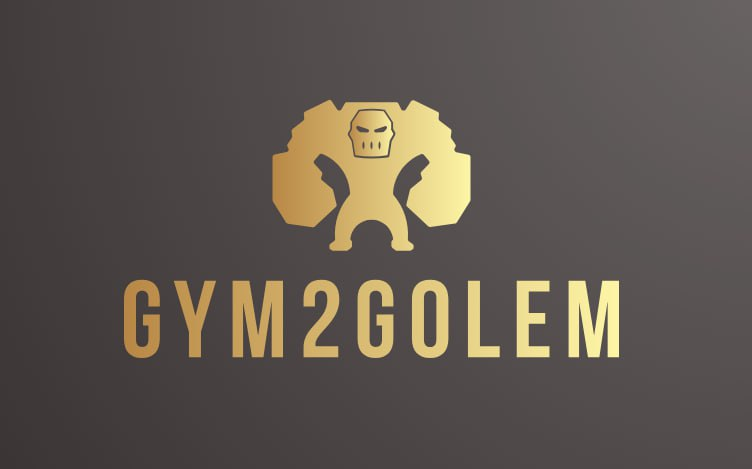
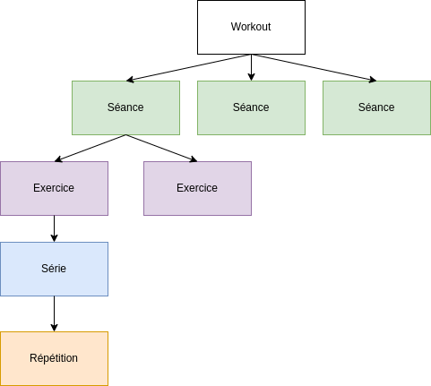
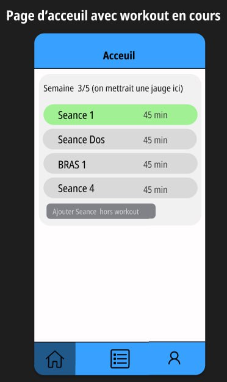
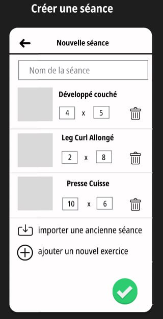
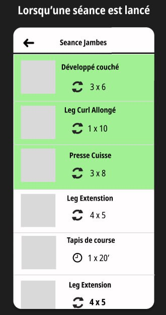
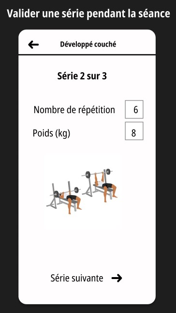
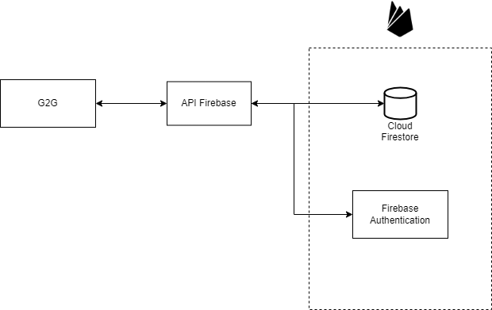

# PDG-GRP5
Dorian Gillioz, Jérémie Santoro, Oscar Baume, Théo Coutaudier

## Description du projet
Application mobile (avec version WEB) qui accompagne les utilisateurs durant leurs séances de sport.

L'application correspond à un modèle de séances de sport avec des séries, répétitions, poids, ...

Organisation de nos entités expliquée avec le schéma ci-dessous (chaque parent peut avoir plusieurs enfants) :

Un Workout est un ensemble de séances qui seront effectuées sur une semaine. Ces séances pourront être répétées plusieurs semaines de suite selon le souhait de l'utilisateur. (Le nombre de semaines sera défini à la création du workout)

# Pourquoi utiliser Gym2Golem ?

Marre d'oublier à chaque fois tes PR (Personal Record) et quel poids tu as utilisé lors de ta séance ? Marre de ne pas te rappeler de tes premiers poids pour voir ton évolution ? Marre d'inscrire toutes tes séances sur un bloc note ?
Gym2Golem est fait pour toi !!!

L'application accompagne l'utilisateur dans son aventure fitness, Gym2Golem offre la possibilité d'être accompagné AVANT, PENDANT et APRES l'entraînement!

Avant: L'utilisateur peut planifier ses séances à l'avance pour ne pas perdre de temps durant sa séance.

Pendant: L'utilisateur peut se concentrer à 100% sur ses performances sportives sans se soucier du reste, l'application va le guider tout au long série après série, exercice après exercice. Il pourra donc se focaliser sur ses performances sportives et donc devenir plus fort.

Après: L'utilisateur peut voir ses performances sous tout les angles pour voir son progrès analyser sa forme et rester motivé avec Gym2Golem.

*Become a Golem NOW with Gym2Golem !*

# Démonstration rapide de l'application avec des mockups

1. Sur cette page d'accueil on peut voir les workouts que l'on a actuellement en cours, on peut voir en vert les séances hebdomadaires déjà effectuées et en gris celles qu'il nous reste à faire d'ici la fin de la semaine.

2. Sur cette page on crée une séance en choisissant les exercices ainsi que le nombre de séries et répétitions prévues.

3. Sur cette page on se trouve à la salle de gym et on vient de finir un exercice, on a donc le choix de poursuivre avec un des exercices restants (en gris).

4. Après avoir effectué notre série on rentre le nombre de répétions effectuées ainsi que le poids utilisé.

### Architecture
Notre application G2G est écrite en Flutter et peut se retrouver sous forme mobile ou WEB

### Choix technique
1. Frontend
Nous avons choisi Flutter car étant une petite équipe voulant développer une app mobile sur Android et iOS et éviter de faire du code à double il s'agit de la meilleure solution pour effectuer la tâche dans le temps imparti.
Un autre avantage de Flutter est la possibilité de pouvoir également servir une app web avec le même code source.
2. Backend
Nous avons choisi Firebase qui est un BaaS qui propose des services tel que l'authentification et le stockage de données avec la BD orientée documents (Firestore).
Firebase nous permet également d'utiliser Hosting pour hoster notre build WEB.
Firebase et Flutter étant 2 produits Google la cohabitation entre ces 2 parties sera aisée.

### Description du processus de travail (git flow, devops, ...) 
- Les tests unitaires ainsi que la vérification des warnings (flutter test et flutter analyze) sont effectués à la fois en local et sur une VM via les GitHub Actions (commit and build).
Le but est d'avoir des dev qui commit le + souvent possible pour garantir régulièrement que la solution est toujours OK (passe les tests).
- Chaque commit qui fix un bug doit venir avec un test case.
- Le build est toujours disponible à la dernière version buildé en version web sur internet (hosté par Firebase Hosting).

1. Le développeur choisi la tâche qu'il va effectuer, puis la convertit en issue tout en ouvrant une feature branch liée à l'issue.
2. Le dev travaille sur la feature branch et une fois terminé il effectue une pull request de sa feature branch sur main.
3. Quand un développeur pull request sur la branche main, son travail est build puis, soumis aux différents tests mis en place dans notre application Dart ainsi qu'une analyse de warnings
4. Si les tests passent et la pull request est approuvé par un autre collègue, le commit est accepté et un build est généré puis hébergé sur Firebase Hosting (lien vers le site WEB à jour sur la landing page)
5. La dernière version du build est donc en tout temps disponible pour tout le monde

### Outils de développement (VCM, Issue tracker, ...)
VCM: Git (avec GitHub)

Issue Tracker: 
- GitHub Issues avec utilisation de tag tel que backend et frontend pour faciliter le filtrage des différentes tâches.
- Utilisation de 3 milestones différents pour pouvoir catégoriser les tâches par importance:
   1. First usable version (contient le STRICT MINIMUM pour que l'application prenne vie, ex: authentification, création des workouts, navigation correcte entre les pages)
   2. Required additions (contient toutes les fonctionnalités qui doivent être ajoutées selon le CDC mais qui ne sont pas vitales, ex: afficher la photo de profil de l'utilisateur)
   3. Possible additions (contient toutes les tâches considérées comme des ajouts éventuels, qui sont hors des functional requirments)

Kanban: Nous allons utiliser GitHub Project pour notre Kanban. Notre Kanban aura 4 colonnes : Backlog/WIP/Review/Done
Lors de nos stand up meeting nous deciderons des issues a résoudre lors de ce sprint et elles seront placées dans la colonne "Backlog". Durant ce même meeting nous assignerons à chaque personne du groupe son travail pour le sprint. Les premières issues seront alors mises dans la colonne "WIP". Lorsqu'une personne pense avoir terminé son issue en cours elle déplacera son issue dans la colonne "Review" et demandera a un membre du groupe de review son travail avant de merge sa branche sur le main afin qu'il soit deploy. Après avoir fini une issue elle est placée dans la colonne "Done". 

### Environnement de déploiement
Nous avons décidé d'utiliser Firebase Hosting pour hébérger notre application.

Nous avons fait ce choix pour rester dans l'environnement Google et notamment Firebase.

### Pipeline de livraison et de déploiement (CI/CD)
1. Le développeur commit son code sur sa feature branch
2. Une fois la feature branche terminée il merge celle-ci sur main
3. La GitHub Action se déclenche
   - Installation de flutter
   - Flutter clean
   - Installation des packages
   - Analyse du code (warnings)
   - Lancement des tests
   - Build du projet (version web)
   - Déploiement du build sur Firebase Hosting
  4. Le commit est maintenant validé et la version de l'app est mise à jour sur le site web

## Requirements fonctionnels
- L'utilisateur peut se connecter et retrouver toutes ses données peu importe la machine depuis laquelle il se connecte
- L'utilisateur peut créer des workouts ou il donne les séances qu'il voudrait faire chaque semaine (il peut mettre plusieurs fois la même séance)
- L'utilisateur peut définir pendant combien de semaine il souhaite effectuer un workout, les séances seront les même chaque semaine 
- L'utilisateur peut créer des séances qu'il pourra ensuite assigner à ses workouts
- L'utilisateur peut créer des exercices qu'il pourra ensuite assigner à ses séances
- L'utilisateur peut voir ou il est en est dans ses workouts semaine après semaine, c'est à dire qu'il voit les séances qu'il a déjà effectuées et celles qui doivent encore l'être (il ne peut avoir que 1 seul workout actif à la fois)
- L'utilisateur peut réutiliser des anciennes séances ou des anciens workouts 
- L'utilisateur peut stopper son workout et le reprendre par la suite s'il le désire (enlever le workout de l'écran d'accueil)
- Les séances sont composées d'exercices par défaut proposés par l'application ou des exercices personnalisés ajoutés par chaque utilisateur (les exercices crées ne seront visibles que pour l'auteur de l'exercice)
- Durant la séance de sport l'utilisateur peut rentrer son nombre de répétitions et le poids utilisé pour chaque série de chaque exercice (il y aura cependant des valeurs pré-remplis). Si il s'agit d'un exercice dans le temps il pourra savoir combien de temps il a pris.
- Pour chaque exercice il existe un PR (Personal Record) qui n'est autre que la valeur maximale effectuée par l'utilisateur sur cet exercice, si le PR est battu un petite animation apparait à l'écran 
- Pendant la séance l'utilisateur peut voir son PR pour l'exercice qu'il effectue afin de voir son objectif en vue
- L'utilisateur peut accéder à son profil et y mettre une photo de profil (https://pub.dev/packages/image_picker) ainsi qu'un pseudonyme
- L'utilisateur peut avoir accès à divers stats tel que le poids total soulevé ou le nombre de temps passé à faire du sport
- L'utilisateur pour voir l'evolution des performances qu'il a effectuer au fil du temps, par exemple le poids que l'utilisateur a soulevé pour un exercice sous forme de graphe

### Ajouts éventuels
- Possibilité d'avoir des amis pour comparer leurs performances (ex: PR)
- Possibilité d'ajouter une séance "live" qui est une séance qui ne fait pas parti du workout en cours (utile si on veut faire un entraînement à l'improviste)
- Les workout, les séances et les exercices peuvent être partagés entre utilisateur
- L'utilisateur peut voir pour chaque exercice son évolution avec notamment des graphes (partie statistiques)
- Possibilité de faire des superset
- Photo + poids chaque fin de mois (avec notif) pour évolution https://pub.dev/packages/firebase_messaging
- Lier avec le nb de pas de l'appareil (nécessite de travailler avec les spécificités iOS et Android)
- Notification (FCM) quand on arrive à la fin d'un workout pour se préparer à faire le suivant
- Historique workouts/séances/exercices effecutés (il faudra donc stocker quand est effectué chacun) https://pub.dev/packages/fl_chart
- Ajout d'un chrono entre les séries, mais dès qu'il le désire il peut stopper le temps de repos pour passer à la série suivante. Cela inclurait une nouvelle Vue séparant chaque série
- Page "explorer" (dans la barre de navigation) pour voir les exercices, séances et workout les + populaires que les utilisateurs pourraient importer

## Requirements non fonctionnels
### Sécurité
- Un utilisateur non authentifié ne peut pas accéder à autre chose que la page d'inscription/connexion de l'app
- Seul les données de l'utilisateur sont visibles par l'utilisateur (authentifié)
- Un utilisateur ne peut pas voir les données d'un autre
- Une fois que l'utilisateur supprime ses données toutes les données liées à cet utilisateur doivent être supprimées pour complaire aux règles de l'UE sur la gestion des données
### Compatibilité
- Le système doit tourner autant bien sur smartphone iOS que Android
### Conformité
- Quand un utilisateur supprime son compte toutes les données qui lui sont liés seront supprimées
### Usabilité
- L'application doit être facilement utilisable par des personnes qui sont à la salle de gym et qui ne sont pas forcément très concentré sur l'app car ils fournissent des efforts intensifs (il faut éviter de devoir passer par plusieurs touches d'écran pour pouvoir faire ce qu'ils ont envie de faire, ex: enregistrer les résultats de leur exercice). Cela sera réaliser en ajoutant par exemple des valeurs par défaut pour éviter que l'utilisateur ait besoin de remplir tous les champs systématiquement
### Evolutivité
- Notre application doit pouvoir tenir 50 utilisateurs faisant leur séance en même temps
### Performance
- Les fenêtres doivent changer de manière fluide et en moins de 1 seconde
### Disponibilité
- L'application doit être disponible 7j/7 24h/24

## Description de la méthodologie
Utilisation de SCRUM

Nos sprints durent 2 jours, assez court pour pouvoir en faire assez et avoir des feedbacks régulieres et assez long pour pouvoir faire assez de travail dans le temp imparti.
1. On regarde ensemble ce qu'il faut faire et on ajoute les tâches à un backlog
2. On répartit les différentes tâches entre les membres du groupe en fonction de leurs préférences et capacités
3. A la fin du sprint (ou plus tôt si 2 membres du groupe sont déjà disponibles), on fait du code review ensemble pour vérifier que le code soit maintenable et suffisamment compréhensible puis on merge la pull request
4. Une fois les codes validés, on passe au sprint suivant (1.)

Le projet contiendra une branche principale main et une branche pour chaque feature (tâche/issue)

Convention de nommage des commits: [WIP], [DONE] [FIXED] puis le nom de la tâche issue du backlog ex: [WIP] Ajout d'un bouton pour supprimer le compte
WIP: En cours mais pas encore terminé
DONE: La tâche est terminée et prête à être review
FIXED: Modification (si nécessaire) d'une tâche après code review

## Mockups et différentes pages de notre application
Lien vers nos mockups: https://www.figma.com/file/fkh4ZoSzWQvWqY41R9Oc9H/G2G?type=design&node-id=0-1&mode=design&t=pG1VP4pjxEdOBTaZ-0
### Inscription - Connexion
- Connexion avec Google
### Progression de la semaine en cours (PAGE D'ACCUEIL)
- Si aucun workout en cours -> Propose de se rendre sous Gestion/Workouts
- Affichage du workout en cours et suivi des semaines (ex: semaine 2/5)
- Affichage des séances restantes pour la semaine actuelle
- Il est possible de refaire une même séance bien que cela sera précédé par un message demandant de confirmer à l'utilisateur son choix car cela ne ferait théoriquement pas de sens de vouloir refaire une séance que l'on a déjà effectué (surtout si il en reste d'autres qui n'ont pas encore été faites)
- Quand l'utilisateur veut faire sa séance de sport il choisit une des séances restantes de son choix qui va lancer l'affichage *Séance en cours*
#### Séance en cours
- L'utilisateur choisit dans les exercices possibles quel exercice faire l'un après l'autre (il peut choisir l'ordre qu'il veut si par exemple est une machine occupée)
- Une fois la série lancée il va pouvoir rentrer combien de répétitions il a fait ainsi que le poids utilisé, puis clique pour passer à la série suivante ou l'exercice suivant si il a fini toutes les séries de son exercice
- Une fois l'exercice terminé il se retrouve sur la page ou il peut choisir un exercice parmi les restants
- Si la séance est terminée l'utilisateur et renvoyé sur la PAGE D'ACCUEIL et la séance effectuée est marquée comme terminée (avec par exemple une coloration en vert)
### Gestion (bien évidemment impossible de modifier ou supprimer d'éventuels entités importées)
- Workouts: Créer, modifier et supprimer des workouts
- Séances: Créer, modifier et supprimer des séances
- Exercices: Créer, modifier et supprimer des séances
### Gestion utilisateur avec paramètres (comme sur insta)
#### Paramètres
- Dark and light mode / choix d'un thème (ajout éventuel)
- Version actuelle de l'app
- Feedkback: report a bug
- Supprimer le compte (règles EU)
- Log out
- Modifier mdp, email, ... (si on se décide à ne pas partir sur une connexion avec Google
#### Utilisateur
- Changer pseudo
- Changer PP
- Afficher le nb de séances effectuées, le nb de poids poussé en tout, ...
##### Mes performances
- On peut voir le PR pour chaque exercice qu'on a fait depuis la création du compte
- Par la suite on pourrait avoir accès depuis la même page à tout autre type de statistiques tel que l'évolution du poids, l'évolution avec les photos chaque fin de mois, ...

## Landing page
https://gilliozdorian.wixsite.com/gym2golem

Contient la version WEB hébérgé sur Firebase Hosting en cliquant sur "Get Started".
