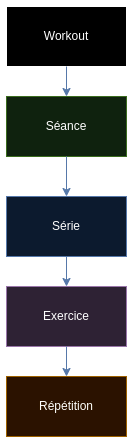

# PDG-GRP5 - Dorian Gillioz, Jérémie Santoro, Oscar Baume, Théo Coutaudier

## Description du projet
Application mobile (avec version WEB) qui accompagne les utilisateurs durant leurs séances de sport.

L'application correspond à un modèle de séances de sport avec des séries, répétitions, poids, ...

Organisation de nos entités: Workout(planning) -> Séances -> Exercices

L'application accompagne l'utilisateur dans son aventure fitness, Gym2Golmon offre la possibilité d'être accompagné avant, pendant et après l'entraîement!

Avant: L'utilisateur peut planifier ses séances à l'avance pour ne pas perdre de temps durant sa séance

Pendant: L'utilisateur peut se concentrer à 100% sur ses performances sportives sans se soucier de quoi faire car l'application va le guider tout au long. Il pourra donc battre ses PR plus facilement

Après: L'utilisateur peut revoir ses differentes performances sous la forme de différentes statistiques pour voir son progrès avec Gym2Golmon.

*Become a Golmon NOW with Gym2Golmon !*

TODO: on peut avec des mokcup montrer un use case scenario

### Architecture

### Choix technique
1. Frontend
Nous avons choisi Flutter car étant une petite équipe voulant développer une app mobile sur Android et iOS et éviter de faire du code à double il s'agit de la meilleure solution pour effectuer la tâche dans le temps imparti.
Un autre avantage de Flutter est la possiblité de pouvoir également servir une app web avec le même code source
2. Backend
Nous avons choisi Firebase qui est un BaaS qui propose des services tel que l'authentification et le stockage de données avec la BD orientée documents (Firestore)
Firebase nous permet également d'utiliser Hosting pour hoster notre build WEB
Firebase et Flutter étant 2 produits Google la cohabitation entre ces 2 parties sera aisée
### Description du processus de travail (git flow, devops, ...)
1. Quand un developpeur commit, son travil est soumis aux différents tests mis en place dans notre application Dart
2. Si les test passent, le commit est accepté et un build est généré puis hébérgé sur Firebase Hosting (lien vers le site WEB à jour sur la landing page)

### Outils de développement (VCM, Issue tracker, ...)
VCM: Git (avec GitHub)

Issue Tracker: GitHub Issues

Kanban: GitHub Project

### Environnement de déploiement
Nous avons décidé d'utiliser Firebase Hosting pour hébérger notre application.

Nous avons fait ce choix pour rester dans l'environnement Google et notamment Firebase.

### Pipeline de livraison et de déploiement (CI/CD)
1. Le développeur commit son code
2. La GitHub Action se déclenche
   - Installation de flutter
   - Flutter clean
   - Installation des packages
   - Analyse du code (warnings)
   - Lancement des tests
   - Build du projet (version web)
   - Déploiement du build sur Firebase Hosting
  3. Le commit est maintenant validé et la version de l'app est mise à jour sur le site web

### Démo du déploiement d'une modification
TODO

## Requirements fonctionnels
- L'utilisateur peut se connecter et retrouver toutes ses données peu importe la machine depuis laquelle il se connecte
- L'utilisateur peut créer des workouts ou il donne les séances qu'il voudrait faire chaque semaine (il peut mettre plusieurs fois la même séance)
- L'utilisateur peut créer des séances qu'il pourra ensuite assigner à ses workouts
- L'utilisateur peut créer des des exercices qu'il pourra ensuite assigner à ses séances (poids et nb de rep de ceux-ci par défaut)
- Les séances sont composés d'exercices par défaut proposés par l'application ou des exercices personnalisés ajoutés par chaque utilisateur (les exercices crées ne seront visibles que pour l'auteur de l'exercice sauf si ce dernier le partage)
- Durant la séance de sport l'utilisateur peut rentrer son nombre de répétitions et le poids utilisé pour chaque série de chaque exercice (il y aura cependant une valeur par défaut de 8 répétitions pour faire gagner du temps à l'utilisateur)
- Pour chaque exercice il existe un PR (Personal Record) qui n'est autre que la valeur maximale effectuée par l'utilisateur sur cet exercice, si le PR est battu un petit truc cool devrait se passer à l'écran au moment de la validation :)
- L'utilisateur peut voir pour chaque exercice qu'il a fait son PR
### Ajouts éventuels
- Possiblité d'avoir des amis pour comparer leurs performances (ex: PR)
- Calendrier hebdo pour Oscar
- Possiblité de faire des exercice "live" (impro), exercices en dehors des séances
- Les workout, les séances et les exercices peuvent être partagés entre utilisateur
- L'utilisateur peut voir pour chaque exercice son évolution (graphe?)
- Superset
- Création de séance assité (meilleurs exo en 1er etc)
- Photo + poids chaque fin de mois (avec notif) pour évolution
- Lier avec le nb de pas de l'appareil (necessite de travailler avec les specificites iOS et Android)
- Notification (FCM) quand on arrive à la fin d'un workout pour se préparer à faire le suivant
- Historique workouts/séances/exercices effecutés (il faudra donc stocker quand est effectué chacun)
- Pour les exercices avec du temps, lancer un timer dans l'app

## Requirements non fonctionnels
### Sécurite
- Seul les données de l'utilisateur sont visibles par l'utilisateur (authentifié)
- Un utilisateur ne peut pas voir les données d'un autre
### Compatibilité
- Le système doit tourner autant bien sur smartphone iOS que Android
### Conformité
- Quand un utilisateur supprime son compte toutes les données qui lui sont liés seront supprimées
### Usabilité
- L'application doît être facilement utilisable par des personnes qui sont à la salle de gym et qui ne sont pas forcément très concentré sur l'app car ils fournissent des efforts intensifs (il faut éviter de devoir passer par plusieurs touches d'écran pour pouvoir faire ce qu'ils ont envie de faire, ex: enregistrer les résultats de leur exercice)
### Evolutivié
- Notre application doit pouvoir tenir 50 utilisateurs faisant leur séance en même temps
### Performance
- Les fenêtres doivent changer de manière fluide et en moins de 1 seconde
### Disponibilité
- L'application doit être disponbile 7j/7 24h/24
### Fiabilité

## Description de la méthodologie
Utilisation de SCRUM
Nos sprints durent 2 jours, assez court pour pouvoir en faire assez et avoir des feedbacks régulieres et assez long pour pouvoir faire assez de travail dans le temp imparti.
1. On regarde ensemble ce qu'il faut faire et on ajoute les tâches à un backlog
2. On répartie les différentes tâches entre les membres du groupe en fonction de leurs préférences et capacités
3. A la fin du sprint, on fait du code review ensemble pour vérifier que le code soit maintenable et suffisament compréhensible
4. Une fois le code validé on passe au sprint suivant (1.)
Le projet sera décompsé en plusieurs parties pour éviter qu'on se marche dessus (chaque partie correspond à une branche git):
- Front-end (fb_front): Design de l'application avec Flutter
- Back-end (fb_back): Endpoints qui fait le lien entre le front-end et Firebase en Dart
Convention de nommage des commits: [WIP], [DONE] puis le nom de la tâche issue du backlog ex: [WIP] Ajout d'un bouton pour supprimer le compte

## Mockups
### Gestion
- Workouts: Créer, modifier et supprimer des workouts
- Séances: Créer, modifier et supprimer des séances
- Exercices: Créer, modifier et supprimer des séances (exercices de base pas compris)
### Progression de la semaine en cours (PAGE D'ACCUEIL)
- Si aucun workout en cours -> Propose de se rendre sous Gestion/Workouts
- Affichage du workout en cours et suivi des semaines (ex: semaine 2/5)
- Affichage du nombre de séances restantes pour la semaine actuelle
- Il est possible de refaire une même séance bien que cela sera précédé par un message demandant de confirmer à l'utilisateur son choix car ce dernier serait contradictoire avec le workout
- Possiblité de stopper le workout actuel
- Quand l'utilisateur veut faire sa séance de sport il choisit une des séances restantes de son choix qui va lancer l'affichage *Séance en cours*
#### Séance en cours
- L'utilisateur choisist dans les exercices possibles quel exercice faire l'un après l'autre (bien qu'un ordre soit recommandé)
- Une fois l'exercice lancé il va pouvoir rentrer combien de répétitions il a fait ainsi que le poids utilisé
- Entre chaque série un chrono se lance pour que l'utilisateur sache combien de temps de repos il utilise
- Dès qu'il le désire il peut stoper le temps de repos pour passer à la série suivante
- Une fois l'exercice terminé il se retrouve sur la page ou il peut choisir un exercice parmis les restants
- Si la séance est terminée l'utilisateur et renvoyé sur la PAGE D'ACCUEIL et la séance effectuée est marquée comme terminée (avec par exemple une coloration en vert9
### Mes péformances
- On peut voir le PR pour chaque exercice qu'on a fait depuis la création du compte
### Paramètres et gestion utilisateur
#### Paramètres
- Dark and light mode ?
- About version
- Feedkback: report a bug
#### Utilisateur
- Supprimer le compte (règles EU)
- Log out
- Modifier pseudo, mdp, email, ...

## Landing page
Speech (ex: https://studystorm.net) + lien pour télécharger l'APK ou si trop compliqée -> hébérger version WEB sur netlify
https://gilliozdorian.wixsite.com/gym2golmon

# Questions
-

# TODO
- Réorganiser le README
- Demander confirmation du README à l'assistant
- Démo de déploiement
- Citer probleme de base -> solution (avec mockups a theo)
- Affiner la landing page
- Mockups a theo
